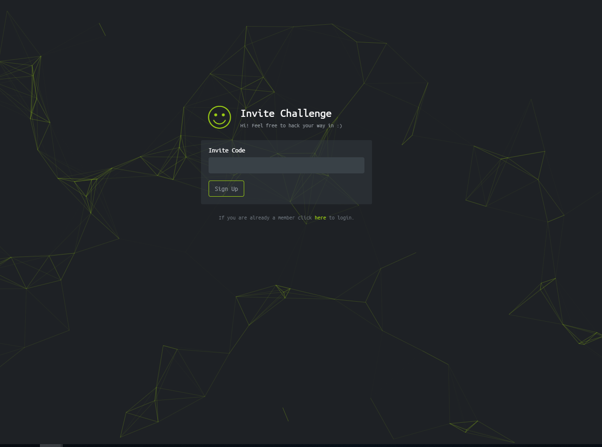

# (カンニング込みで)HackTheBoxにログイン出来るようになった話  

## 目次  
1. [HackTheBoxの紹介と自己紹介](#導入)  
    - [自己紹介](#自己紹介)  
    - [HackTheBoxについて](#について)  
    - ["登録できた"の意味](#意味)  
1. [最初にやったこと](#はじめにやったこと)
1. [カンニングをする](#詰まったので)
1. [再度自力で解いてみた](#出てきたものを解いていく)
1. [なぜか解けなかった・・・](#まさかの入力ミス)
1. [(カンニング込みで)HackTheBoxにログイン出来るようになった話](#(カンニング込みで)HackTheBoxにログイン出来るようになった話)
<!--※導入とか諸々は後で！  
臭い自己紹介・サイトの紹介とかは後でやりまつ。  -->

### [HackTheBoxの紹介と自己紹介](#導入)  
- [自己紹介](#自己紹介)  
    ITの知識が無い状態でIT企業に就職し、インシデントレスポンス系のベンダーで営業をして早2年が経過しようとしています。2年経つと言ってもプログラムを書いたりしたこともなく、せいぜい情報セキュリティマネジメントの資格勉強をしたくらいで、ほぼほぼ技術を身に着けて来ませんでした。何かこの分野で手を動かして始めてみたいという思いがずっとあり、同僚から「イベントでこんなん紹介されて面白そうだったよ～」と聞いて今回HackTheBoxに登録しようと思い立った結果、色々ありこの記事を書くに至りました。  

- [HackTheBoxについて](#意味)  
    [このページ](https://www.hackthebox.eu/)のこと。  
    オンラインでできるCTFやハッキングラボが常設されたサイト。*ログインできると*世界各国でアクセスしている状況が随時ランキング形式で表示されているトップページに行けます。ちなみにイベントで聞いてきたという同僚の話によると、「日本人の登録者数が少なすぎるので皆さん登録してください」と紹介されていたらしいです。  

- ["登録できた"の意味](#意味)  
    と、こんな感じで書いているが「ログインできた話」ってなんだよ勝手にしろよという感じなのですが、[登録ページ](https://www.hackthebox.eu/invite)に行くと以下の画像のようなページが出てくるのです。<!--画像のリンク頼む-->
  
    InviteCodeとは？そんなんあったっけ？と色々探しても見当たりません。
    つまり、HackTheBoxに登録するためにもCTF的技能を駆使して、このページからInvite Codeなるものを見つけてくる必要があるわけです！(そして自分にはその技能がなかった・・・)  
    というわけで、今回自分が登録するにあたって、知っていたこと・やったこと・調べたことを自分の振り返りのために書いていきます。  

 

### [最初にやったこと](#はじめにやったこと)  
<!--とりあえずやったことをまとめていこう-->  
Invite Codeを見つけるにあたって、昔の職場の先輩(転職済)の方から、
「WebページのCTFをやるのならまずは開発者ツールを見ていくといいよ～」と前にちょろっと教えてもらっていたので、Chromeで開発者ツールを開いて見ていった。  

<!--画像のリンク頼-->
開いてまず出てくる、Elementsのタブでリンクとして表示されているものにアクセスしていってみた。リンクは下記の3つ。
- "https://www.hackthebox.eu/js/htb-frontend.min.js"  
- /js/inviteapi.min.js  
- https://www.hackthebox.eu/js/calm.js  

まずひとつ目のリンク("https://www.hackthebox.eu/js/htb-frontend.min.js")にアクセスすると以下のページが出てきました。  
<!---画像のリンク-->
  
ｳｷﾞｷﾞ、ﾅﾝﾀﾞｺﾚﾊ、ﾀｽｹﾃとなったので、他もアクセスしてみて分からなかったらまた探しに来ようと決めて、次へ。  

ふたつ目のリンク(/js/inviteapi.min.js)  
な、なんだこれは、どうやってアクセスすればいいんだぁー！となって、色々調べる。結果、Webサーバーとかドメインの意味とかに行き着く。そして、ふと、あれ、これ他のリンクと一緒でhttps://www.hackthebox.eu を付ければいいんじゃね？と閃きやってみたところ、本当にそのとおり、ページが開いた。

ただし、これも上記と一緒でよくわからんページに。eval(function(p,a,c,k,e,r)ってのがどうやらjavascriptで難読化されたものを表すものらしい・・・？(/packer/というツール?で行われたものらしい。分からん。このへんも勉強しなければ・・・)とりあえずもう最後のリンクも開いてみる。~~保留という名の諦め。~~<!--画像のリン-->  

最後のリンク、"https://www.hackthebox.eu/js/calm.jsにアクセスしたところ"、なんかドクロ出てきた・・・

console.logから始まっていたので、HTBのトップページについて開いていたchromeの開発者ツールに戻り、Consoleタブを開いてみたところ、このドクロ、いる～～～！！！となる。

[このへん](https://www.sejuku.net/blog/27205)のページとかを調べてみたところ、やはりConsoleに任意の値とか文字列とかを表示するためのコマンドらしい。ここに関しては、あんまり(Sing Upのためには)関係なさそうだぁ、上記2つについてもう少し調べてみるかぁとなる。  

・・・結果なんもわからんとなる。  
javaをほんの、ほんの、ほんの少しかじってたので(javaとjavascriptが違うことはわかっているが)if文とかそういうのがjavascriptにもあるんだなぁみたいなバカみたいな思考に陥る。後は開発者ツールのSourcesタブとか見るが、ここに関しては本当に知識不足のためなんもわからんとなり、ここで数日置くことになる・・・  

 

#### [カンニングをする](#詰まったので)
数日後、やっぱSign Upまでは行きたいなとなり、*カンニング*を解禁。[このページ](https://codeburst.io/hack-the-box-how-to-get-invite-code-56e369fc8dae)に行き着く。  
ここを見ていたところ、ふたつ目のリンクのページの"response ~"というところが怪しいと記載してある。どうやらjavascriptを実行する際の呼び出しのコマンドらしい。ホォーーーってなる。で、この人が言うには"makeInviteCode"ってコマンドが怪しいとのこと。
Consoleタブの下のところに入れてみると、下記の画像のものが呼び出された。
  
 

#### [再度自力で解いてみた](#出てきたものを解いていく)  

と、まあカンニングをしてとりあえず前に進めたのでここからは再度自分の力で解いていってみることに。。。

POST〜と書いてあって、偶然ちょっと前にPOSTとGETについてはちょろっと知ってた(初学者向けのネットワーク本ちょろっと読んでたのでなんとなくデータの送信方法?方式?だったな〜って感じで)ので、POSTでデータを送る方法を調べる。。。  
chromeの拡張…というよりアプリが公式より出ているらしいので入れてみる。  
なんかBASE64で難読化がかけられてるよ〜って親切に言ってる文章が返されてきた。

[CyberChef](https://gchq.github.io/CyberChef/)で難読化を解いてみると、再度POSTでデータを送ってみろって文章が出てきた。

再度POSTで送ってみたところ、謎の文章の羅列と"format" : "encorded"の文字が。出てきた。。。これは！ということで最初にアクセスしたページのInvitCodeの部分に入れてみると・・・
  

 

#### [なぜか解けなかった・・・](#まさかの入力ミス)  
そして、やってみたところ、入力ミスの文字が。
  
えぇ。。。となり、手詰まったため、もう一度1からやってみる。  
と、次はPOSTでデータを送った際に難読化がBASE64を指定していた部分がROT13になっている！

POSTの送信先は同じだったので、再度同じようにPOSTで送ってみるとまた"encoded"の文字とともにまた難読化されてるっぽい意味不明な文字列が・・・  
再度CyberChefで次はROT13でやってみると、文字化けたっぽい文字列が出てきた。  
それでは、ということでBASE64でやってみたところ、最初に解けた際と同じような5文字×5のランダムな文字列が！がしかし、最初と文字列の内容自体は違ったので「一回目この文字列入れてダメだったけどもう一回やってみるか～」ということで、トップページのInviteCodeの部分にこの文字列を入れてみた。  
 

#### [(カンニング込みで)HackTheBoxにログイン出来るようになった話](#(カンニング込みで)HackTheBoxにログイン出来るようになった話)
上記のものを入れてみると***Congratulation***の文字が！！！！！！

ログイン用のアカウントの作成を行ってSign Inすると、各国のランキングとか出てくる。。。  
どうやらInviteCodeは常にランダムで生成されているらしく、ちゃんと手順を踏んで、一定時間内に解いて該当の部分に文字列を入れないといけなかったぽい(もしくは普通にコードのコピペを間違ってたかも・・・)よく出来てるなぁ・・・  
利用するには基本的にVPNとかつなぐ必要があるらしいとのことなので、次は準備とかの話をしたりとか今回分からなかった知識の部分をしたいです。  
 
p.s.  
これ書くにあたって画像を貼ろうとしたときにローカルの画像を絶対パスで指定してたせいでずっと画像が出てこなくて「はあ～～～？」ってずっとなってました。Markdownにも早く慣れたい。ITむっず。  
 

了

