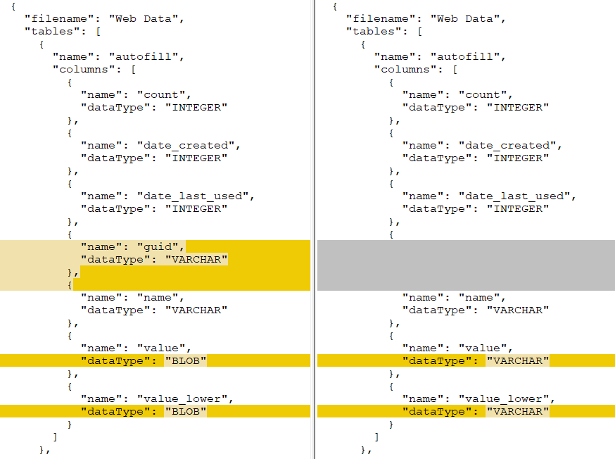
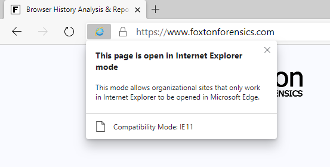

https://www.foxtonforensics.com/blog/post/investigating-web-history-in-the-new-edge-chromium-browser
このページの翻訳。本稿は[foxtonforensics](https://www.foxtonforensics.com/)様に許可をいただいてあげさせていただきました。  
自分でも検証してみたいところ・・・  

 

# 新たなChromium版Edgeのウェブの履歴に関する調査  

2020年1月15日にMicrosoft社は[Chromium](https://en.wikipedia.org/wiki/Chromium_(web_browser)#Browsers_based_on_Chromium)をベースとした[Edgeブラウザー](https://www.microsoft.com/en-us/edge)の安定版を初めてリリースしました。これは、Windows 7/8/8.1/10とmacOSに対して互換性があります。  

EdgeはChromeを筆頭としたオープンソースであるChromiumブラウザに基づいたWebブラウザに関する開発リストに参加しています。そしてこのことはEdgeが閲覧履歴をChromeとほぼ同じようなフォーマットで保存するようになったことを意味します。Windows10では、通常Edgeのプロファイルは次のディレクトリに保存されています：  
*C:\Users(ユーザー)\\\<username>\AppData\Local\Microsoft\Edge\User Data\Default*

最新の安定版のEdgeとChromeで作成された全てのSQLiteデータベースを[SQLite Examiner](https://www.foxtonforensics.com/blog/post/comparing-sqlite-schemas-across-multiple-databases)を使用して比較したところ、顕著に違いがあったのは**Web Data** SQLiteデータベース内だけでした。

**Web Dataデータベース**には、HTMLの入力フォームなどに使用する様々な自動入力データが格納されます。[前回の記事](https://www.foxtonforensics.com/blog/post/chrome-firefox-linking-form-history-to-web-page-urls)で、フォームの履歴をWebページのURLにリンクする方法を説明しました。そのおかげにより、これらのアーティファクトからこれまでよりも多くの情報(値)を得ることが出来ました。  
現在のChromeは自動入力データをVARCHER列にプレーンテキストで保存していますが、他方Edgeは自動入力データをBLOB列に保存していることがわかります。  

このBLOB列への保存という変更は、Webデータベースに保存する前にEdgeが自動入力データ(オートフィルデータ)を暗号化するためであることが確認できました。暗号化の方法は、ChromeがパスワードおよびCookieの暗号化に使用している方法と同様です。Windowsにおいては、Data Protection API(DPAPI)を使用して行われます。現状、Chromeを始めとした他のChromiumベースのブラウザが自動入力データの暗号化についてEdgeに追従するかは不明です。しかしもし追従する場合、アクセスするのが更に難しい重要なアーティファクトとなります。  
<!--DPAPIとは：http://bit.ly/3cxXlZ4-->

新たなEdgeブラウザの固有の機能の一つにInternet Explorer(IE)モードがあります。これにより、Internet Explorerを使用してレンダリングするWebページをEdgeで開くことが出来ます。  

IEモードによって作成されたアーティファクトについていくつかのテストを行い確認したところ、IEモードでレンダリングされたページはEdgeとInternet Explorerの両方のWeb履歴上に記録されていることを発見しました。  

したがって、たとえEdgeブラウザのみを使用していたとしても、調査時にはInternet Explorerの履歴が見つかってしまう場合もある。  

[Browser History Examiner(BHE)](https://www.foxtonforensics.com/browser-history-examiner/)と[フリーツール](https://www.foxtonforensics.com/free-tools)が更新されChromiumベースのEdgeブラウザを新たにサポートするようになりました。旧バージョンのEdgeについてもサポートは続いています。そのため、Edgeの旧バージョンと新しいバージョンのどちらの履歴も含むマシンを解析している場合にはこれらのツールは新旧両バージョンの履歴をキャプチャして読み込みます。  

Browser History Examiner(BHE)の無料トライアルについては、[ダウンロードページ](https://www.foxtonforensics.com/browser-history-examiner/)を御覧ください。  

